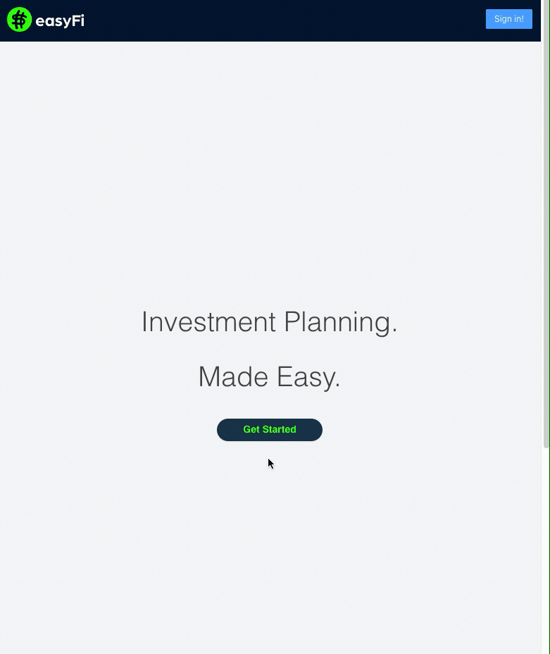
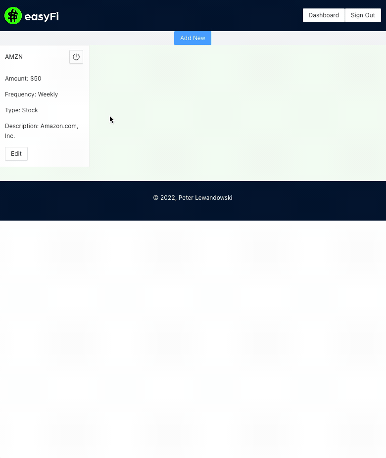

<h1 align="center">
 

 
Investment Planning. Made Easy
 
</h1>

<h4 align="center">A minimal investment planning application built with <a href="https://reactjs.org/" target="_blank">ReactJS</a>.</h4>

  <a href="#description">Description</a> •
  <a href="#roadmap">Roadmap</a> •
  <a href="#how-to-use">How To Use</a> •
  <a href="#stack">Tech Stack</a> •
  <a href="#project-status">Project Status</a> •

## Description
This project was built to help users get started with investing. easyFi application makes it possible to create your own simple investment plans.

#### Features 
- Build your own actionable strategies
- Small, guided steps
- Make it fun, save/edit your strategies (LoginWithGoogle)

## Roadmap

- Edit/Delete existing strategy
- Filter strategies by asset type
- Organize strategies into custom portfolios
- Display current asset price

## How to Use

<h3>Visit
<a href="https://easyfi.me/">https://easyfi.me/</a>
</h3> 

## Stack (F.E.R.N)

- [Firestore](https://firebase.google.com/)
- [ExpressAPI](https://expressjs.com/) + [GC App Engine](https://cloud.google.com/appengine)
- [ReactJS](https://reactjs.org/)
- [Node.js](https://nodejs.org/en/)

This project was bootstrapped with [Create React App](https://github.com/facebook/create-react-app).

## Project Status

This is a personal project built as part of the Boca Code Fullstack Software Engineering Career Course (March '22). It fulfilled all necessary requirements for graduation including:

1. Must solve a problem
2. Own database
3. Own API (https://github.com/peterlewandowski/easyfi-project-api)
4. Web frontend in React
5. Fully deployed to the cloud
6. User must be able to INTERACT and make a visible CHANGE to the database

Bonus:
- User login
- Custom README
- Mobile responsive

Next Steps: 

Continue testing, add upcoming features (<a href="#roadmap">Roadmap</a>) to hone Fullstack developer skill set.